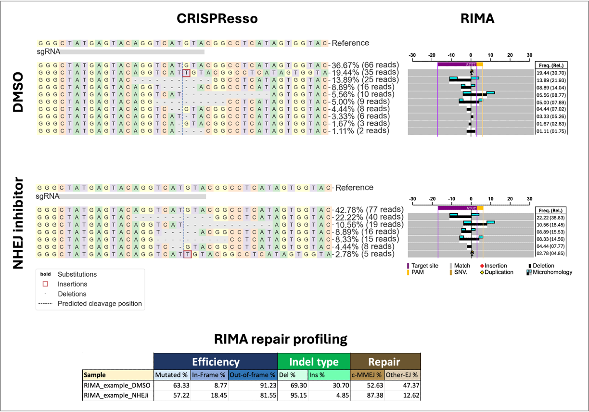

# ATG_CRISPResso2_To_RIMA2

## Background
Non-Homologous End Joining (NHEJ) and Microhomology-Mediated End Joining (MMEJ) are two highly conserved DNA repair pathways in eukaryotic cells. The NHEJ repair pathway is error-prone; it can repair DNA double-strand breaks (DSBs) either precisely or by introducing small insertions or deletions (indels). The MMEJ repair pathway, however, typically repairs DSBs by introducing deletions. Notably, a variation of MMEJ is thought to introduce de novo insertions. Classical MMEJ (c-MMEJ) repair events refer to deletions associated with microhomologies.

Studying repair events at Cas9 target sites in human cells provides insights into the cell's DNA repair capacity and can be used as an assay to screen compounds that alter DNA repair pathways. One method of studying repair events at Cas9 cleavage sites is through amplicon sequencing and bioinformatics analysis. Several data analysis packages are available for such studies, with CRISPResso being the most widely used software. CRISPResso can delineate modified reads into Homology-Directed Repair (HDR) and non-HDR events. However, it does not distinguish between NHEJ and MMEJ events, and all erroneous repairs are collectively categorized as NHEJ (non-HDR).

RIMA (Rational Indel Analysis Software), an Excel-based tool, was developed to specifically identify c-MMEJ deletions.

This repository contains:

 - A Python script ATG_CRISPResso2_to_RIMA2.py, which reads CRISPResso output (specifically the Allele_Frequency_Table.zip file) and generates variant tables that can be used as RIMA input.
 - The RIMA Excel workbook, which analyzes variant tables, produces statistics on repair events, and provides an informative graphical representation of the alleles.

## RIMA use cases
 - **Restrictly** where the a wild-type Cas9 (or its variations like PEn) is used (especifically, SpyCas9 or Type-IIB Cas9s). 
 - HDR templates can be used only if the HDR repair outcome is insertion of 3 nucleotides or more.
 - Up to 12 different repair template can be used, only if the repair outcome is the insrtion of 3 nucleotides or more.
 - Except extended insertions, other repair events are classified into *c-MMEJ* and *Other-EJ*.
 - Single nucleotide variations are considered sequencing errors and are eliminated from the analysis. Therefore, HDR experiments that exchange bases must not be analyses using RIMA.

## Requirements

```
crispresso2=2.2.14
```

## Step-by-step guideline (Mac and Linux)

### Install Miniconda
Conda is an open-source package and environment management system that allows user to conviniently create new environments and install packages. Follow the official Conda installation guideline here: https://docs.anaconda.com/free/miniconda/miniconda-install/ 

### Download this repository
```
git clone https://github.com/ghahfarokhi/atg_crispresso2_to_rima2
cd atg_crispresso2_to_rima2
```

### Create atg_crispresso2_to_rima2 environment
```
conda env create -f environment.yml
conda activate atg_crispresso2_to_rima2
```

Test that the installation of CRISPResso2 has been successful: 
* `CRISPResso -h` prints the help page for CRISPResso2.

For detailed description of CRISPResso functionalities and alternative ways of installation refer to its official github page: https://github.com/pinellolab/CRISPResso2

### Run CRISPResso and `ATG_CRISPResso2_to_RIMA2.py` script
Run CRISPResso with a desired set of paramaters (`-a` and `-g` are required parameters for RIMA analysis). For this guideline, the following codes uses the test fastq data that are provided withinn this repository with the following amplicon ref and guide sequences:

```
cd test_data

CRISPResso -r1 01_fastq_examples/example_DMSO.fastq -a CGAGTCTAGAGGGCCCGTTTAAACCCGCTGGGCCATGGGCTATGAGTACAGGTCATGTACGGCCTCATAGTGGTACAGTAGTGACTCAAGACGATAGTTACCGGATAAGGCGCAGCGGTCGGGCTGAACGGGGGGTTCGTGCACACAGCCCAGCTTGGAGCGAACGACCTACACCGAACTGAGATACCTACAGCGTGAGCTA -g CTATGAGTACAGGTCATGTA -o 02_crispresso_examples/

CRISPResso -r1 01_fastq_examples/example_NHEJi.fastq -a CGAGTCTAGAGGGCCCGTTTAAACCCGCTGGGCCATGGGCTATGAGTACAGGTCATGTACGGCCTCATAGTGGTACAGTAGTGACTCAAGACGATAGTTACCGGATAAGGCGCAGCGGTCGGGCTGAACGGGGGGTTCGTGCACACAGCCCAGCTTGGAGCGAACGACCTACACCGAACTGAGATACCTACAGCGTGAGCTA -g CTATGAGTACAGGTCATGTA -o 02_crispresso_examples/

cd ..

python ATG_CRISPResso2_to_RIMA2.py  --out ./test_data/04_RIMA/

```

The test fastq files provided in `test_data/01_fastq_examples/` are simulated for two samples transfected with SpyCas9 and a sgRNA, and treated with either DMSO or an NHEJ-inhibitory compound (NHEJi). 

See CRISPResso output for DMSO and NHEJi samples:
* [CRISPResso_on_example_DMSO.html](https://ghahfarokhi.github.io/ATG_CRISPResso2_to_RIMA2/test_data/02_crispresso_examples/CRISPResso_on_example_DMSO.html)
* [CRISPResso_on_example_NHEJi.html](https://ghahfarokhi.github.io/ATG_CRISPResso2_to_RIMA2/test_data/02_crispresso_examples/CRISPResso_on_example_NHEJi.html)


The following three files should have been generated in the output folder upon successful completion of the python script run:

`ls test_data/04_RIMA/`

Output:
``` 
RIMA_example_DMSO-variants.tsv
RIMA_example_NHEJi-variants.tsv
experiment_sheet.tsv
```

`column -t test_data/04_RIMA/RIMA_example_DMSO-variants.tsv`

Output:
```
VariantNo  Position  Type  Length     Ref  Alt           Count
0          2         57    Insertion  1    -             T      35
1          3         50    Deletion   11   AGGTCATGTAC   -      25
2          4         54    Deletion   5    CATGT         -      16
3          5         57    Deletion   12   GTACGGCCTCAT  -      10
4          6         53    Deletion   10   TCATGTACGG    -      9
5          7         55    Deletion   2    AT            -      8
6          8         57    Deletion   1    G             -      6
7          9         56    Deletion   1    T             -      3
8          10        56    Deletion   4    TGTA          -      2
```

`column -t test_data/04_RIMA/experiment_sheet.tsv`

Output:
```
file_address                                 file_name                        amplicon_seq                                                                                                                                                                                                guide_seq             mapped_reads  wt_count  total_variants  cut_pos  mmej_reads  del_01_bp  del_02_05_bp  del_06_10_bp  del_above_10_bp  ins_01_bp  ins_02_05_bp  ins_06_10_bp  ins_above_10_bp  indel_combos
C:\RIMA\Raw\RIMA_example_DMSO-variants.tsv   RIMA_example_DMSO-variants.tsv   CGAGTCTAGAGGGCCCGTTTAAACCCGCTGGGCCATGGGCTATGAGTACAGGTCATGTACGGCCTCATAGTGGTACAGTAGTGACTCAAGACGATAGTTACCGGATAAGGCGCAGCGGTCGGGCTGAACGGGGGGTTCGTGCACACAGCCCAGCTTGGAGCGAACGACCTACACCGAACTGAGATACCTACAGCGTGAGCTA  CTATGAGTACAGGTCATGTA  180           66        9               56       62.0        9.0        92.0          9.0           35.0             35.0       0.0           0.0           0.0              0.0
C:\RIMA\Raw\RIMA_example_NHEJi-variants.tsv  RIMA_example_NHEJi-variants.tsv  CGAGTCTAGAGGGCCCGTTTAAACCCGCTGGGCCATGGGCTATGAGTACAGGTCATGTACGGCCTCATAGTGGTACAGTAGTGACTCAAGACGATAGTTACCGGATAAGGCGCAGCGGTCGGGCTGAACGGGGGGTTCGTGCACACAGCCCAGCTTGGAGCGAACGACCTACACCGAACTGAGATACCTACAGCGTGAGCTA  CTATGAGTACAGGTCATGTA  180           77        6               56       90.0        0.0        101.0         15.0          59.0             5.0        0.0           0.0           0.0              0.0
```

### Transfer RIMA files to a Win or Mac computer
* Copy and paste `experiment_sheet.tsv` table to **Experiment** worksheet in **RIMA2_v20240420.xlsm** file.
* an already completed RIMA workbook for the test samples in provided in the **test_data** folder.
* Transfer RIMA variant tables to **"C:\RIMA\Raw\"** folder any other location
* In nessesary adjust the file addresses in the ****Experiment** worksheet accordign to your local disk address. 
* *IMPORTANT NOTE*: file addresses should be alphanumerical without spaces.
* Correct the **Total Files** in the **Experiment** worksheet cell "**C13**".
* Proceed to the "**Single**" worksheet, adjust the required user inputs in cells **D11:D13** and **K11:K18**. If insertions at the cut-site are expected, then provide the expected insertion sequences in cells **W6:W17** with their corresponding names in **U6:U17**. 
* Press the **Batch** buttom and follow the instructions.
* Highly recommended close all other Excel workbooks before running RIMA. Also, don't use your computer during the run. 
* Consult the **Log** worksheet to check if any of the samples had errors during the run. 

### RIMA vs CRISPResso


## How to cite RIMA
**RIMA v1**:

Taheri-Ghahfarokhi A, Taylor BJM, Nitsch R, Lundin A, Cavallo AL, Madeyski-Bengtson K, Karlsson F, Clausen M, Hicks R, Mayr LM, Bohlooly-Y M, Maresca M. Decoding non-random mutational signatures at Cas9 targeted sites. Nucleic Acids Res. 2018 Sep 19;46(16):8417-8434. doi: 10.1093/nar/gky653. [PMID: 30032200](https://pubmed.ncbi.nlm.nih.gov/30032200/); PMCID: PMC6144780.


**RIMA v2**:

Wimberger S, Akrap N, Firth M, Brengdahl J, Engberg S, Schwinn MK, Slater MR, Lundin A, Hsieh PP, Li S, Cerboni S, Sumner J, Bestas B, Schiffthaler B, Magnusson B, Di Castro S, Iyer P, Bohlooly-Y M, Machleidt T, Rees S, Engkvist O, Norris T, Cadogan EB, Forment JV, Šviković S, Akcakaya P, Taheri-Ghahfarokhi A, Maresca M. Simultaneous inhibition of DNA-PK and Polϴ improves integration efficiency and precision of genome editing. Nat Commun. 2023 Aug 14;14(1):4761. doi: 10.1038/s41467-023-40344-4. [PMID: 37580318](https://pubmed.ncbi.nlm.nih.gov/37580318/); PMCID: PMC10425386.
